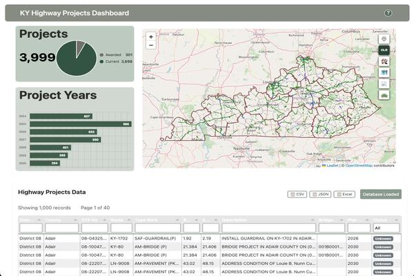

# KY Highway Projects Dashboard

An interactive web dashboard for visualizing Kentucky highway project data with filtering capabilities and interactive mapping.

## Features

- **Interactive Maps**: Click on highway project lines to view detailed information
- **Multi-Level Filtering**: Filter by district, county, and project type with automatic chart updates
- **Dynamic Panel Titles**: Panel titles automatically update to reflect active filters (e.g., "Projects in District 2" or "Projects in Fayette County")
- **Project Type Classification**: Intelligent project categorization using crosswalk database for standardized filtering
- **Data Visualization**: Pie charts and bar charts showing project statistics with real-time updates
- **Advanced Data Table**: Sortable, filterable, and paginated table with export capabilities
- **Data Export**: Download project data in CSV, JSON, or Excel formats
- **Multiple Basemaps**: Switch between OpenStreetMap, Esri World Street Map, USGS Topo, and OpenTopoMap
- **Clear All Filters**: One-click button to reset all active filters
- **Responsive Design**: Works on desktop and mobile devices

## Live Demo
Visit the dashboard at: https://terid.github.io/KY_Highway_Plan_Projects/

---
## Use of AI Statement
As I have been a Python developer for many years, I feel that AI is an excellent tool that should be utilized.  I have employed AI to the benefit of existing ETLs and improve efficiency and performance. I did use AI during the building of this project. But, because of my previous experience, I know that an AI is only as good as the skills of the user.

My approach to AI in this project use was to build out individual components first in separate parts.  I started with my first component during week 2 of Module 1 when we were asked to "Create something of interest".  I began working on a mapping interface
and a call to the KYTC Spatial API (see https://terid.github.io/WebDev_PotholeReporter/).

Within Visual Studio Code, my preferred IDE, I utilize GitHub Copilot. My preferred AI agent for coding requests is Claude Sonnet 4. I have used it more rigorously in other projects, but limited its use within this project. AI was used in troubleshooting simple problems of missing brackets, but more often helped me find the cause of a particular bug. I also used it to assist with error-handling logic, like try/catch blocks.

The use of AI didn't replace my judgement, but definitely made finding errors more efficient. I have found that while Chat GPT can answer questions, it's answers are frequently insufficient to solve issues fully. I did use Chat GPT to assist in creating my initial wireframe diagram. I know that CHAT GPT is frequently used to generate documentation, but I have written professional technical articles and documentation; Chat GPT's grammar is less than adequate.

## Dashboard Interface



*The interactive dashboard showing Kentucky highway projects with filtering controls, interactive map, charts, and data table.*

---

## Technologies Used

- **Frontend**: HTML5, CSS3, JavaScript
- **Mapping**: Leaflet.js with multiple basemap options
- **Charts**: Chart.js for data visualization
- **Data Table**: Tabulator.js for advanced table features
- **Database**: SQLite with SQL.js for client-side queries
- **Styling**: Bootstrap 5.3.3 for responsive design

## Data Sources

- Kentucky Transportation Cabinet (KYTC)
  - Highway project data with geographic locations
  - County and district boundary files

## Filtering System

The dashboard provides three levels of filtering that can be used independently or in combination (work in progress):

### District Filter
- Filter by KYTC districts (1-12)
- Automatically zooms to district boundaries
- Updates all charts and tables to show district-specific data

### County Filter
- Search-enabled dropdown with all 120 Kentucky counties
- Type to search for specific counties
- Zooms to county boundaries when selected from list
- Updates all charts and tables to show county-specific data

### Project Type Filter
- Intelligent categorization using crosswalk table in SQLite database
- Map displays only the project type selected via standardized categories

### Dynamic Titles
- Panel titles automatically update to reflect active filters
- Examples:
  - "Projects in District 2"
  - "Projects in Fayette County"
  - "Projects in District 7 in Fayette County (Bridge Construction)"
- Clear visual feedback about what data is being displayed

## Usage

1. Open the dashboard in a web browser
2. Database loads on page initiation, but a "Load Database" button will refresh the data if it does not.
3. Use the filter controls along the right side of the map (in order):
   - **Change Basemap**: Select from one of four available basemaps.
   - **Clear All**: Reset all active filters at once 
   - **County Filter**: Search and filter by county name.
   - **District Filter**: Filter by KYTC district (1-12)
   - **Project Type Filter**: Filter by standardized project categories
   - **KYTC API Call**: Initiates process to retrieve in-depth information from KYTC Spatial API for all project routes.
     - Follow prompt to select a highway project line.
     - Zoom in on the map (using the Zoom tool in the upper left map corner).
     - Hover over line segment (mouse cursor will change).
     - Click on the line segment -> popup window with API data will appear over the graph area providing detailed route information.
       - Route information may be copied or exported as needed from the popup window controls.   
5. **Panel titles automatically update** to show active filters (e.g., "Projects in District 7 in Fayette County")
6. Click on highway project lines (colored lines on map) to view detailed project information
7. Use the table's built-in sorting and filtering capabilities.
8. Export data from the table using the CSV, JSON, or Excel buttons.
10. Charts and data automatically update based on selected filters.

## File Structure

```text
├── css/
│   ├── style.css             # Custom styling for main page
|   └── auxillary.css         # Custom styling for additional text pages
├── data/
│   ├── *.geojson             # Spatially aware files for map display
│   ├── HighwayPlan_data.db   # SQLite database with project data
│   └── *.csv                 # Tabular data to be imporeted into SQLite db
├── images                    # Reference images, wireframes and icons in the project
├── js/
│   └── download.js           # Auxillary logic for downloading datasets for continuous refresh (work in progress)
│   └── script.js             # Main application logic
├── References/               # Supporting documentation
├── disclaimer.html           # Statement of originality of work as KYTC contract employee
├── download.html             # Data refresh options page (work in progress)
├── help.html                 # User assistance page for details on Web UI & tools
├── index.html                # Main dashboard page
├── README.md                 # Project Overview and Details regarding the project.
```


## License

This project is for educational/demonstration purposes.
