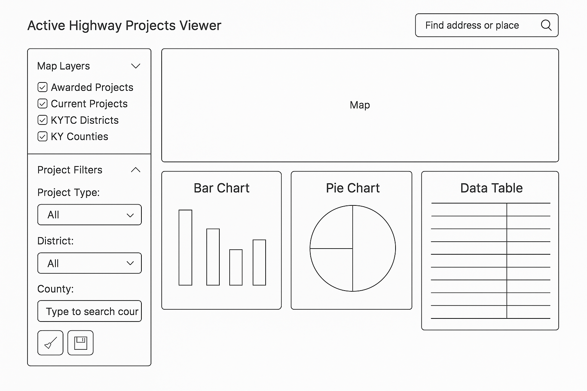

# Active Highway Projects Viewer

## Abstract

The **Active Highway Projects Viewer** is an open-source, public-facing interactive dashboard that enables users to explore current and awarded highway construction projects in Kentucky—independently of the Esri software stack. Built with modern JavaScript frameworks and leveraging open data APIs and spatial visualizations, the application empowers the public, contractors, and government stakeholders with intuitive access to authoritative project data.

This tool visualizes the Approved Six-Year Highway Plan (6YP), a legislatively approved framework updated biennially by the Kentucky General Assembly. The 6YP outlines major highway improvement projects across the state and is developed collaboratively with KYTC, Area Development Districts (ADDs), MPOs, and Highway District Offices.

The Viewer supports map-based exploration, interactive filtering, and dynamic charting through open APIs—promoting transparency and public engagement in infrastructure development.

---

## Problem Statement

KYTC currently offers Esri-based GIS tools for construction project data, but these present limitations due to licensing, performance, and public accessibility. The need exists for a modern, responsive, open-source dashboard that eliminates reliance on proprietary tools and provides flexible and intuitive access to project information.

---

## Goals and Objectives

- Build an interactive dashboard using open web technologies.
- Eliminate dependency on proprietary Esri tools.
- Integrate KYTC public APIs (e.g., Spatial API).
- Store/query project data with SQLite for offline portability.
- Implement filters for district, county, and project type.
- Ensure a responsive UI for desktop and mobile.

---

## Features

### Mandatory Integration
- **KYTC Spatial API** for route-specific project metadata.

### Core Features
- Display project locations on a Leaflet.js map.
- Filters for District, County, and Project Type with searchable dropdowns.
- Summary cards: Active Projects, Total Projects, Total Length (by extent).
- Use `fetch()` to retrieve public data and store in SQLite/JSON.
- Visualizations using **Plotly.js** (bar and pie charts).
- Responsive design using Flexbox/Grid and media queries.

### Additional Features
- Analyze and display data stored in arrays, objects, sets, or maps.
- Implement modern interactive UI features (e.g., data sorting, autocomplete).
- Use a JavaScript framework: **Svelte**.

---

## Stretch Goals

- Integrate **Svelte** for component interactivity.
- Data table with sorting and autocomplete (via Tabulator.js).
- Bookmark/download project reports.
- Browser-side caching/localStorage.
- User feedback modal + email export option.

---

## Technologies

- **Frontend:** HTML5, CSS3 (Bootstrap 5), JavaScript ES6+, Svelte (optional)
- **Mapping:** Leaflet.js, Esri Leaflet plugin, GeoJSON
- **Visualization:** Plotly.js
- **Database:** SQLite (via JavaScript or pre-processed with Python)
- **APIs/Data:** KYTC Spatial API, Open Data (GeoJSON/CSV), `fetch()`
- **Dev Tools:** Git, GitHub, VS Code, Python, ChatGPT, Grammarly, Tabulator.js, PanZoom

---

## Architecture

---

## UI Mockup

---

## Timeline & Milestones

| Week | Tasks |
|------|-------|
| **1** | UI layout, filters, basemap, schema setup |
| **2** | Fetch → SQLite pipeline, map population, API integration |
| **3** | Plotly chart integration, start Tabulator |
| **4** | Filter polish, responsive layout, commit logs |
| **5** | README, fetch+SQLite documentation, device testing |
| **6** | Add Svelte components (optional), user bookmark logic |
| **7** | Usability testing, feature cleanup, UI polish |
| **8** | Final testing and feature confirmation |
| **9** | Final polish, bug fixes, submission |

---

## Risks and Mitigation

| Risk | Mitigation |
|------|------------|
| SQLite limitations in-browser | Pre-generate using Python and bundle |
| API limits or downtime | Cache key data, fallback to JSON |
| Svelte build complexity | Optional feature only |
| Timeline delays | Modular dev with weekly reviews |
| Data structure changes | Schema-aware fetch parsing |

---

## Testing and Evaluation Plan

- **Manual Testing**: Across Chrome, Safari, Firefox.
- **Responsive Testing**: Dev tools + physical devices.
- **User Feedback**: Peer/mentor input.
- **Performance**: Map load speed, filter responsiveness.
- **Code Quality**: Encapsulation, AI usage comments.
- **Functional Checklists**: For filters, charts, API usage.

---

## License

MIT License

---

## Acknowledgments

- Kentucky Transportation Cabinet (KYTC)
- Open Data providers
- CodeYou/Data Analytics Capstone instructors & mentors

---

## Data Management and Updates

### Downloading Latest Dataset

The application includes a built-in data refresh feature that connects to the KYTC Data Hub:

1. **Manual Download**: Click the download button (💾) in the sidebar under "Project Filters"
2. **Automatic Download**: The system attempts to fetch the latest data from `https://trak.kytc.ky.gov/data-hub`
3. **Fallback Method**: If CORS restrictions prevent automatic download, the system opens the KYTC Data Hub in a new tab for manual download

### Data Source

The primary dataset is the **EDA Current Enact Plan Data Set** (`eda_current_enact_plan_data_set.csv`) which contains:

- Project information by district and county
- Route details and descriptions
- Funding information and timelines
- Award and letting dates
- Project phases and types

### Data Structure

The CSV contains the following key fields:

- `DISTRICT`: Kentucky Transportation District (1-12)
- `COUNTY`: County name where project is located
- `SYP_NO`: Six-Year Plan project number
- `ROUTE`: Highway route designation
- `TYPE_WORK`: Type of work being performed
- `DESCRIPTION`: Project description
- `ENACT_YEAR`: Year project was enacted
- `FUND_CODE`: Funding source code
- `AWARDED`: Award status
- `LATEST_LETTING_DATE`: Most recent letting date

### Update Frequency

The KYTC Data Hub is updated regularly by the Kentucky Transportation Cabinet. Users should refresh the dataset periodically to ensure they have the most current project information.